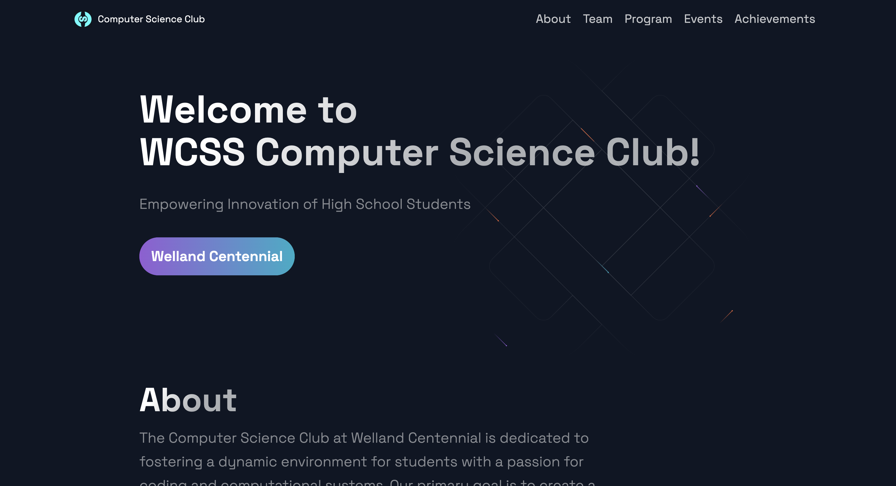

# WCSS Computer Science Club Website 🌐💻

{: width="300" }

## Empowering Innovation of High School Students 📚🚀
Welcome to the **WCSS Computer Science Club**! We are dedicated to fostering a dynamic environment for students with a passion for coding and computational systems. Our mission is to create a vibrant community that embraces diversity, welcomes students from all backgrounds, and offers a platform for growth and learning in the realm of computer science.

### Key Features:
1. **About**: Learn about the club's mission and goals to support high school students passionate about technology and coding 🖥️
2. **Team**: Meet the individuals leading the club and driving its initiatives 🌟
3. **Program**: Explore the focus of our current curriculum on Python, HTML/CSS, and JavaScript 📚
4. **Upcoming Events**: Stay updated on the club’s upcoming events and opportunities for involvement 🎉
5. **Achievements**: Celebrate our milestones, including our growing number of members and lesson hours 🏆

### Technology Used:
- **HTML** for structuring the website content 📄
- **CSS** for styling the website and creating a clean layout 🎨
- **JavaScript** for adding interactive elements such as event details and team member profiles 🧠

### Program Focus:
Our club will focus on mastering the following programming languages:
1. **Python**: Earn a certificate 🏅
2. **HTML/CSS**: Build your own website 🌐
3. **JavaScript**: Add complex functions to your projects 🛠️

### Achievements:
- **50+ Members**
- **70+ Hours of Lesson**

### How to Run:
Clone the repository and open `index.html` in your browser to explore the site and learn more about the Computer Science Club!

```bash
git clone https://github.com/YuYeon-K/Welland-Centennial-CS-Club.git
cd wcss-computer-science-club
open index.html
